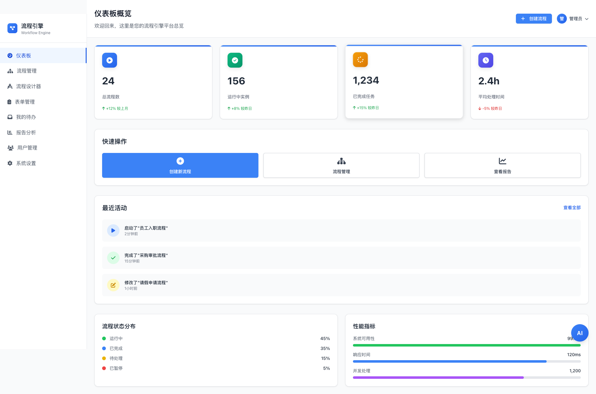
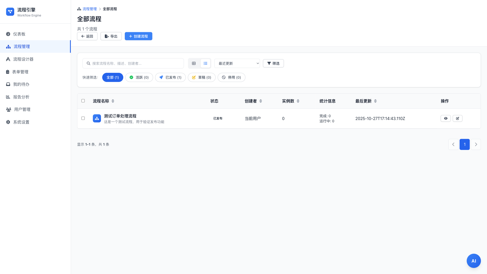
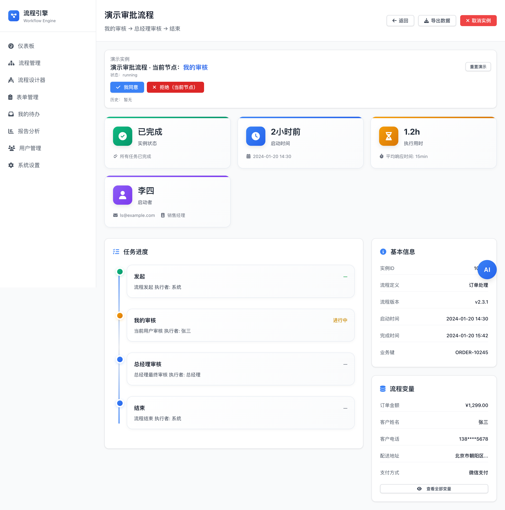

# Workflow Engine Vue 

Production‑ready, modern workflow UX built with Vue 3 + Pinia + Tailwind. Design processes visually, manage forms, track instances, and analyze performance — all in one beautiful, responsive UI. [简体中文](README.zh-CN.md)

<div align="center">
<br/>
<p align="center">
  <a href="https://github.com/peterfei/workflow-engine-vue/stargazers"></a>
  <a href="https://github.com/peterfei/workflow-engine-vue/network/members"></a>
  
  
  
  
  
</p>
</div>




## Why this project

- **Self‑developed workflow engine** — built from scratch, production‑ready, commercially viable
- **Visual process designer** — drag‑drop nodes, real‑time validation, minimap navigation, undo/redo
- **Complete workflow management** — process list, instance tracking, form designer, analytics dashboard
- **Enterprise‑grade features** — data persistence, export/import, keyboard shortcuts, grid snapping, multi‑select

## Features

- Process Designer: drag‑drop nodes, connect, validate, export/import
- Forms: gallery with categories and quick actions
- My Work: inbox of pending/started/done, demo flow included
- Process List: filters, sorting, status badges, stats
- Instance Detail: status card, timeline, variables, metrics
- Reports: trends, distribution, hot processes, performance
- Responsive layout and accessible components

## Tech Stack

- Vue 3 (Composition API)
- Pinia (state management)
- Vue Router 4
- Tailwind CSS
- Vite

## Quick Start

Prerequisites: Node.js 16+, npm 8+

```bash
npm install
npm run dev
# open the URL printed by Vite (e.g. http://localhost:3001)
```

Build and Preview:

```bash
npm run build
npm run preview
```

## Screenshots

<p align="center"></p>
<p align="center"></p>
<p align="center"></p>
<p align="center"></p>
<p align="center"></p>

## Project Structure

```
src/
├─ assets/
├─ components/
├─ stores/
├─ views/
├─ router/
└─ utils/
```

## Roadmap

- Keyboard help panel (optional)
- Alignment guides and connection redraw (optional)
- Virtualization for huge canvases (>100 nodes) (optional)

## Contributing

PRs welcome! If you plan a larger change, please open an issue to discuss first. Keep PRs focused and small where possible.

## Community

- Issues: bug reports, feature ideas, questions are appreciated
- Stars: if this project helps you, please give it a star — it helps others discover it

## License

MIT © 2025 peterfei
