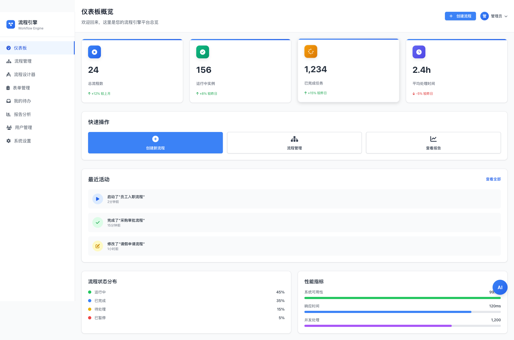
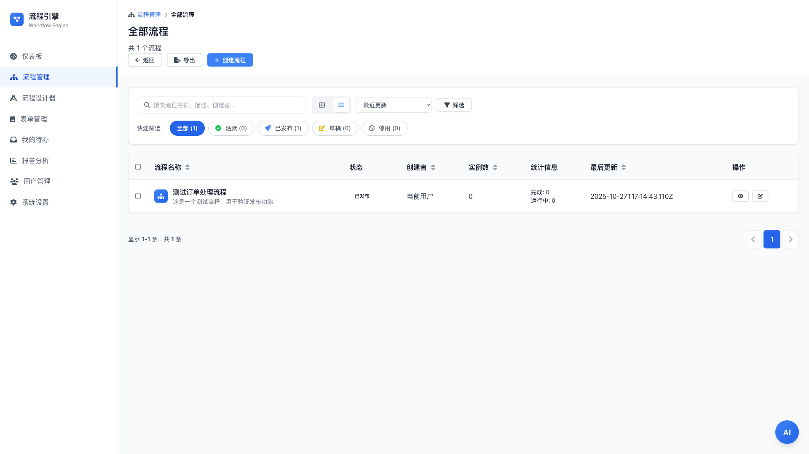
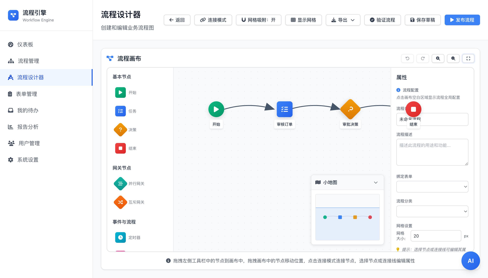
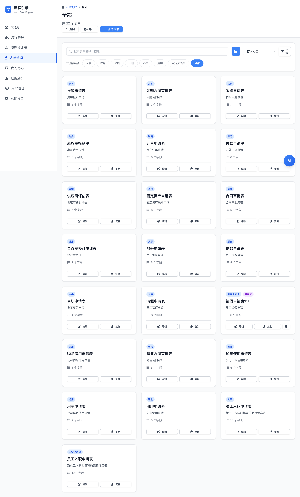
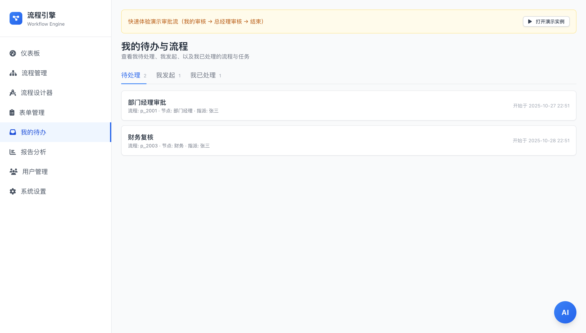
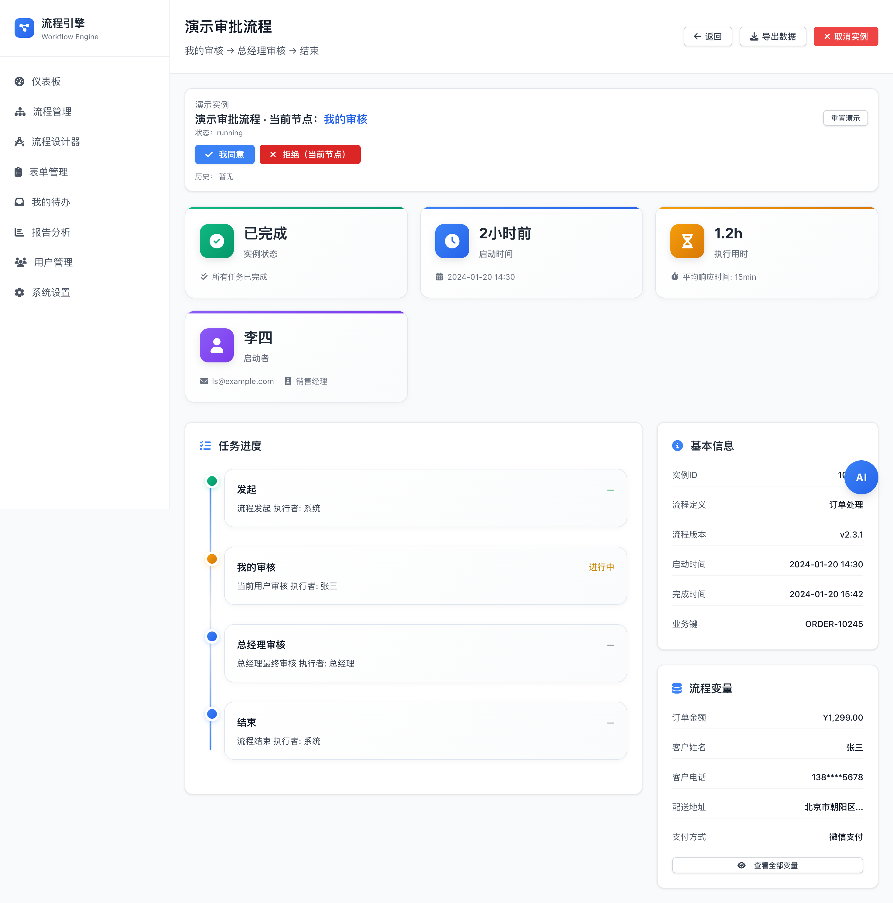

# 流程引擎Vue版 

面向生产的现代化流程引擎前端，基于 Vue 3 + Pinia + Tailwind。可视化设计流程、管理表单、跟踪实例、分析性能，一套全覆盖解决方案。 [English](README.md)


<div align="center">
<p align="center">
  <a href="https://github.com/peterfei/workflow-engine-vue/stargazers"></a>
  <a href="https://github.com/peterfei/workflow-engine-vue/network/members"></a>
  
  
  
  
  
</p>
</div>



## 为什么是它

- **自研流程引擎** — 从零打造，生产就绪，可商用
- **可视化流程设计器** — 拖拽节点、实时校验、小地图导航、撤销重做
- **完整工作流管理** — 流程列表、实例追踪、表单设计器、分析仪表板
- **企业级特性** — 数据持久化、导入导出、快捷键、网格吸附、多选批量操作

## 功能特性

- 流程设计器：拖拽节点、创建连接、校验规则、导入导出
- 表单：按分类的表单库与快捷操作
- 我的待办：待处理/我发起/我已处理，内置演示流程
- 流程管理：筛选、排序、状态徽章与统计
- 实例详情：状态卡片、任务时间线、变量与指标
- 报告分析：趋势、分布、热门流程与性能
- 响应式布局与可访问性组件

## 技术栈

- Vue 3（Composition API）
- Pinia（状态管理）
- Vue Router 4
- Tailwind CSS
- Vite

## 快速开始

准备：Node.js 16+、npm 8+

```bash
npm install
npm run dev
# 打开 Vite 输出的地址（如 http://localhost:3001）
```

构建与预览：

```bash
npm run build
npm run preview
```

## 截图

<p align="center"></p>
<p align="center"></p>
<p align="center"></p>
<p align="center"></p>
<p align="center"></p>

## 目录结构

```
src/
├─ assets/
├─ components/
├─ stores/
├─ views/
├─ router/
└─ utils/
```

## 路线图

- 键盘快捷键帮助面板（可选）
- 对齐辅助线与连接线重绘（可选）
- 画布虚拟化（>100 节点）（可选）

## 参与贡献

欢迎 PR！如计划较大的变更，请先提交 Issue 讨论。尽量保持 PR 聚焦与小粒度。

## 社区

- Issues：欢迎 Bug 反馈、功能建议与提问
- Star：如果这个项目对你有帮助，请点亮 Star，帮助更多人发现它

## 许可证

MIT © 2025 peterfei
